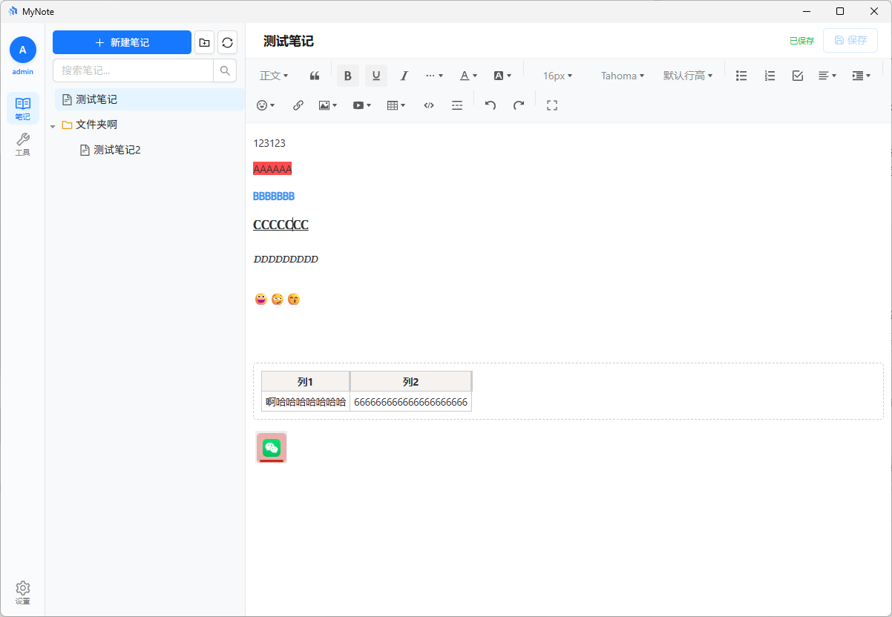
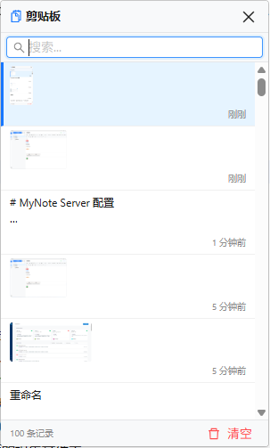

# MyNote

> 个人笔记程序 — 桌面客户端（Tauri 2） + 云端同步服务

**技术栈：** Tauri 2 (Rust) + Vue 3 + TypeScript + Pinia + wangEditor 5 + SQLite

---

## 截图




---

## 功能概览

### 📝 笔记管理
- **树形笔记组织** — 支持文件夹/笔记两级结构，拖拽排序
- **富文本编辑** — 基于 wangEditor 5，支持标题、列表、表格、代码块、图片粘贴
- **Markdown 快捷输入** — 注册了 `@wangeditor/plugin-md` 插件
- **自动保存** — 可配置间隔（默认 30 秒），内容优先存储到 localStorage 缓存
- **导出 PDF** — 通过浏览器打印预览 → 另存为 PDF
- **搜索过滤** — 实时搜索笔记标题，自动展开命中项的祖先文件夹

### ☁️ 云同步
- 后端服务地址：`https://note.068800.xyz`（HTTP REST API）
- **本地优先** — 所有写操作立即更新本地状态，网络失败不影响编辑
- **后台同步** — 每 30 分钟自动推送脏笔记，或手动点击同步按钮
- **离线创建** — 网络不可用时自动创建带 `local_` 前缀的临时笔记，联网后合并
- **JWT 认证** — 登录/注册，Token 持久化到 localStorage

### 🖥️ 剪贴板面板（Windows 专属）
- **全局快捷键** — `Ctrl+Shift+V` 唤起浮动剪贴板面板
- **无焦点设计** — 面板使用 `WS_EX_NOACTIVATE` + `SW_SHOWNA`，不抢当前窗口焦点
- **历史记录** — 自动监控系统剪贴板变化，文本/图片均可记录到 SQLite
- **搜索过滤** — 面板内实时搜索历史条目
- **键盘导航** — `↑/↓` 选择条目，`Enter` 粘贴，`Esc` 关闭
- **置顶/删除** — 常用条目可置顶，右键菜单支持删除
- **自动隐藏** — 点击面板外区域或按 Escape 自动隐藏
- **SendInput 模拟粘贴** — 选中条目后通过 `SendInput(Ctrl+V)` 粘贴到当前活动窗口

### 🎨 主题系统
- 支持 6 种主题色：默认蓝、阿里橙、极客蓝、微信绿、火山红、炫酷紫
- 有道云笔记风格的 CSS 变量设计系统
- Ant Design Vue 组件主题色联动覆盖

### 🔧 系统托盘
- 关闭主窗口隐藏到系统托盘（不退出）
- 托盘菜单：显示 / 退出
- 托盘图标双击：显示主窗口

---

## 项目结构

```
MyNote/
├── src/                          # 前端 Vue 3 代码
│   ├── main.ts                   # 应用入口：Pinia + Router + Antd
│   ├── App.vue                   # 根组件：初始化用户态、剪贴板监听、主题
│   ├── router/index.ts           # 路由：/ 主界面，/clipboard 剪贴板面板
│   ├── views/
│   │   ├── MainView.vue          # 主布局：Sidebar | ListView | Editor | Tools
│   │   └── ToolsView.vue         # 工具页（预留）
│   ├── components/
│   │   ├── common/
│   │   │   ├── Sidebar.vue       # 侧边栏：头像、导航（笔记/工具）、设置
│   │   │   ├── ListView.vue      # 笔记树列表：a-tree、搜索、右键菜单、拖拽
│   │   │   └── Editor.vue        # 富文本编辑器：wangEditor 5
│   │   ├── clipboard/
│   │   │   └── ClipboardPanel.vue # 剪贴板浮动面板
│   │   ├── dialog/
│   │   │   ├── LoginDialog.vue   # 登录/注册对话框
│   │   │   └── SettingsDialog.vue # 设置对话框（主题、自动保存间隔等）
│   │   └── user/
│   │       ├── AvatarCropper.vue  # 头像裁剪
│   │       └── UserProfileModal.vue # 用户资料弹窗
│   ├── stores/
│   │   ├── noteStore.ts          # 笔记 CRUD + 云同步（本地优先）
│   │   ├── editorStore.ts        # 编辑器状态 + localStorage 内容缓存
│   │   ├── clipboardStore.ts     # 剪贴板面板状态 + Tauri IPC
│   │   └── userStore.ts          # 用户认证状态（JWT）
│   ├── utils/
│   │   └── request.ts            # Axios HTTP 封装（API 调用）
│   └── styles/
│       └── main.css              # 全局样式 + CSS 变量主题系统
│
├── src-tauri/                    # Rust 后端（Tauri 2）
│   ├── src/
│   │   ├── main.rs               # 应用入口：窗口管理、托盘、快捷键、命令注册
│   │   ├── commands/
│   │   │   ├── mod.rs
│   │   │   ├── note.rs           # 笔记 CRUD Tauri 命令（SQLite）
│   │   │   └── clipboard.rs      # 剪贴板 Tauri 命令
│   │   ├── domain/
│   │   │   ├── mod.rs
│   │   │   ├── node.rs           # Node 模型（笔记/文件夹）
│   │   │   └── user.rs           # User 模型
│   │   ├── infrastructure/
│   │   │   ├── mod.rs
│   │   │   └── database.rs       # SQLite 连接池初始化 + 表创建
│   │   ├── services/
│   │   │   ├── mod.rs
│   │   │   ├── clipboard_monitor.rs  # 系统剪贴板轮询监控
│   │   │   └── clipboard_service.rs  # arboard 剪贴板读写封装
│   │   ├── keyboard_hook.rs      # 全局键盘钩子（Escape 隐藏面板）
│   │   ├── mouse_hook.rs         # 全局鼠标钩子（面板外点击隐藏）
│   │   ├── no_activate_window.rs # WS_EX_NOACTIVATE 无焦点窗口管理
│   │   └── paste_executor.rs     # SendInput 模拟 Ctrl+V 粘贴
│   ├── Cargo.toml
│   └── tauri.conf.json           # Tauri 配置：双窗口、安全策略、NSIS 安装
│
├── package.json
├── vite.config.ts
├── tsconfig.json
└── tailwind.config.js
```

---

## 本地开发

### 前置要求

- [Node.js](https://nodejs.org/) >= 18
- [pnpm](https://pnpm.io/)（推荐）或 npm
- [Rust](https://www.rust-lang.org/) nightly toolchain
- [Tauri CLI](https://v2.tauri.app/start/prerequisites/)（含 WebView2）

### 安装依赖

```bash
pnpm install
```

### 启动开发环境

```bash
pnpm tauri dev
```

前端 Vite 开发服务器运行在 `http://localhost:1420`，Tauri 桌面窗口自动打开。

### 构建发布包

```bash
pnpm tauri build --no-bundle
```

生成的安装包位于 `src-tauri/target/release/bundle/`。

---

## 后端 API

笔记云同步依赖后端 HTTP API，基础地址：`https://note.068800.xyz`

| 端点 | 方法 | 说明 |
|------|------|------|
| `/api/auth/login` | POST | 登录 |
| `/api/auth/register` | POST | 注册 |
| `/api/user/profile` | GET / PUT | 用户资料 |
| `/api/user/avatar` | POST | 上传头像 |
| `/api/notes` | GET / POST | 笔记列表 / 创建笔记 |
| `/api/notes/:id` | GET / PUT / DELETE | 笔记详情 / 更新 / 删除 |
| `/api/notes/sync` | POST | 批量同步 |

---

## 架构设计要点

### 本地优先（Offline-First）

所有笔记写操作先更新本地状态（Pinia store 响应式更新 + localStorage 持久化），再尝试推送到服务器。网络失败不影响用户编辑，脏笔记在后台自动重试同步。

### 剪贴板面板无焦点设计

剪贴板面板使用 Tauri 透明窗口 + `WS_EX_NOACTIVATE` 样式，确保：
1. 面板显示时**不抢当前输入窗口的焦点**（用户可继续在原窗口输入）
2. 全局鼠标钩子检测面板外点击 → 自动隐藏
3. 全局键盘钩子检测 Escape 键 → 自动隐藏
4. 选中条目后通过 `SendInput(Ctrl+V)` 粘贴，而非 `window.setFocus()`

### 内容缓存策略

笔记内容在 localStorage 中维护独立的键值缓存（`note-content-cache`），切换笔记时无条件保存当前内容到缓存，切回时从缓存读取，再从服务器拉取最新版本覆盖。

### SQLite 本地数据库

- 笔记节点表（`nodes`）
- 剪贴板历史表（`clipboard_history`）
- 同步队列表（`sync_queue`）
- WAL 模式提升并发读性能

---

## 许可证

MIT
